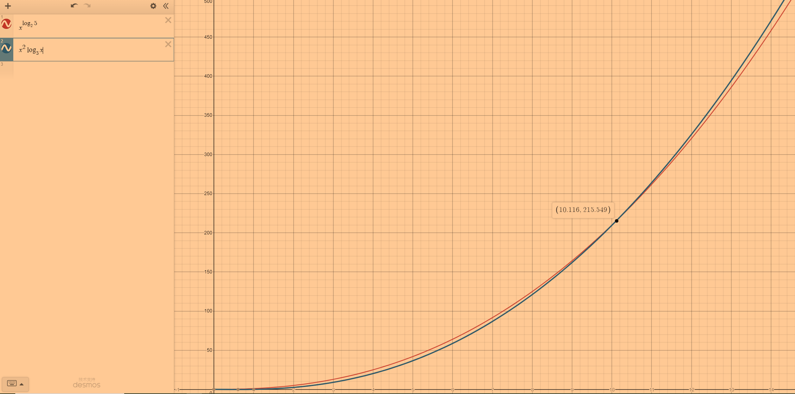

# CMPS 2200 Assignment 2

**Name:** Ruoqin Ji

In this assignment we'll work on applying the methods we've learned to analyze recurrences, and also see their behavior
in practice. As with previous
assignments, some of of your answers will go in `main.py`.. You
should feel free to edit this file with your answers; for handwritten
work please scan your work and submit a PDF titled `assignment-02.pdf`
and push to your github repository.

1. Derive asymptotic upper bounds of work for each recurrence below.
  * $W(n)=2W(n/3)+1$
.  
**Answer:** Let $W(n) = aW(\frac{n}{b})+f(n)$. Then we have $\frac{a}{f(b)}>1(\frac{2}{1}>1)$, which inidicates that $W(n)$ is leaf-dominated. Thus, $W(n) \in O(n^{\log_{3} 2})$
.  
.  
.  
.  
  * $W(n)=5W(n/4)+n$
.  
**Answer:** Since $\frac{5}{4}>1$, it is leaf-dominated. It follows that $W(n) \in O(n^{\log_{4} 5})$
.  
.  
.  
.  
  * $W(n)=7W(n/7)+n$
.  
**Answer:** Since $\frac{7}{7}=1$, it is balanced. It follows that $W(n) \in O(\log_{7}n \cdot n)$
.  
.  
.  
.  
  * $W(n)=9W(n/3)+n^2$
.  
**Answer:** Since $\frac{9}{f(3)}=1 (\frac{9}{3^2}=1)$, it is balanced. It follows that $W(n) \in O(\log_{3}n \cdot n^2)$
.  
.  
.  
.  
  * $W(n)=8W(n/2)+n^3$
.  
**Answer:** 
Since $\frac{8}{f(2)}=1 (\frac{8}{2^3}=1)$, it is balanced. It follows that $W(n) \in O(\lg n \cdot n^3)$
.  
.  
.  
.  
  * $W(n)=49W(n/25)+n^{3/2}\log n$
.  
**Answer:** Since $a = 49, f(b) = 25^{3/2}\log 25 \approx 175$, then we have $\frac{49}{175}<1 $, which is root-dominated. It follows that $W(n) \in O(n^{3/2}\log n)$
.  
.  
.  
.  
  * $W(n)=W(n-1)+2$
.  
**Answer:** The algorithm a balanced recurrence since every level has the asymptotic same cost and there are $n$ levels. Thus, $W(n) \in O(n \cdot 2)$
.  
.  
.  
.  
  * $W(n)= W(n-1)+n^c$, with $c\geq 1$
.  
**Answer:** The algorithm a balanced recurrence since every level has the asymptotic same cost and there are $n$ levels. Thus, $W(n) \in O(n \cdot n^c) = O(n^{c+1})$
.  
.  
.  
.  
  * $W(n)=W(\sqrt{n})+1$
.  
**Answer:** Since $f(x) = 1$, then $f(b) = 1$. It follows that $\frac{1}{f(b)}=1 $, which is balanced. Therefore, $W(n) \in O((\lg(\lg(n)) \cdot 1)$
.  
.  
.  
.  

2. Suppose that for a given task you are choosing between the following three algorithms:

  * Algorithm $\mathcal{A}$ solves problems by dividing them into
      five subproblems of half the size, recursively solving each
      subproblem, and then combining the solutions in linear time.
    
  * Algorithm $\mathcal{B}$ solves problems of size $n$ by
      recursively solving two subproblems of size $n-1$ and then
      combining the solutions in constant time.
    
  * Algorithm $\mathcal{C}$ solves problems of size $n$ by dividing
      them into nine subproblems of size $n/3$, recursively solving
      each subproblem, and then combining the solutions in $O(n^2)$
      time.

    What are the asymptotic running times of each of these algorithms?
    Which algorithm would you choose?
    .  
* **Answer:** 
 
  * For Algorithm $\mathcal{A}$, its work is $W(n) = 5W(\frac{n}{2}) + n$. Thus, it is leaf-dominated and $W(n) \in O(n^{\log_{2}5})$.
  * For Algorithm $\mathcal{B}$, its work is $W(n)=2W(n-1) + k$. We can tell that the number of node in level $i$ is $2^i$ and there are total $n$ lvels. Also since the algorithm combines those solutions in constant time, there are total about $2^n$ work to do. Therefore, $W(n) \in O(2^n)$.
  * For Algorithm $\mathcal{C}$, its work is $W(n) = 9W(\frac{n}{3}) + n^2$, which is a balanced algorithm. Thus, its $W(n) \in O(\log_3n \cdot n^2)$.
  * Analysis: Algorithm $\mathcal{A}$ performs better when input size $n$ is relative small, whileas Algorithm $\mathcal{C}$ performs better when input size $n$ is large. We should choose our algorithm to use depend on our input size. 
  

3. Now that you have some practice solving recurrences, let's work on
  implementing some algorithms. In lecture we discussed a divide and
  conquer algorithm for integer multiplication. This algorithm takes
  as input two $n$-bit strings $x = \langle x_L, x_R\rangle$ and
  $y=\langle y_L, y_R\rangle$ and computes the product $xy$ by using
  the fact that $xy = 2^{n/2}x_Ly_L + 2^{n/2}(x_Ly_R+x_Ry_L) +
  x_Ry_R.$ Use the
  stub functions in `main.py` to implement Karatsaba-Ofman algorithm algorithm for integer
  multiplication: a divide and conquer algorithm that runs in
  subquadratic time. Then test the empirical running times across a
  variety of inputs to test whether your code scales in the manner
  described by the asymptotic runtime. Please refer to Recitation 3 for some basic implementations, and Eqs (7) and (8) in the slides https://github.com/allan-tulane/cmps2200-slides/blob/main/module-02-recurrences/recurrences-integer-multiplication.ipynb
 
 

